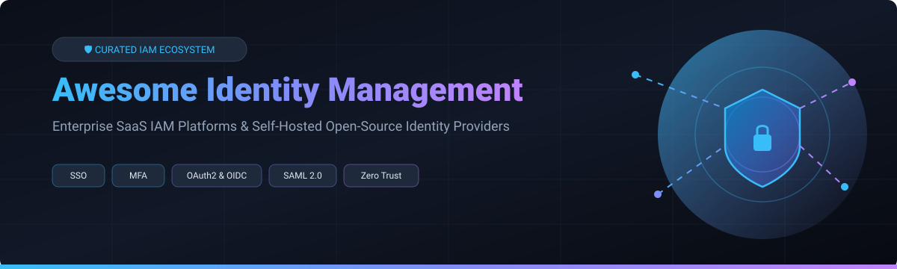
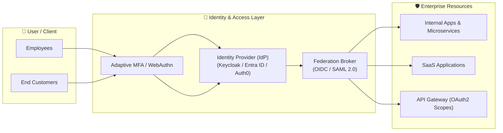

  
  
  

# 🔐 Awesome Identity Management (IAM)

> 🚀 **Curated Directory of Enterprise SaaS IAM Platforms & Self-Hosted Open-Source Identity Providers**
>
> *Comprehensive guide to Single Sign-On (SSO), Multi-Factor Authentication (MFA), Identity Providers (IdP), Workforce & Customer IAM (CIAM), Federation (SAML 2.0, OAuth 2.0, OIDC), and Zero Trust Access Control.*

**Last updated: September 2026**

---

## 📑 Table of Contents
- [📊 Market Overview & Industry Analysis](#-market-overview--industry-analysis)
- [🏢 SaaS & Hosted Identity Platforms](#-saas--hosted-identity-platforms)
- [⚡ Open-Source Identity Providers & Tools](#-open-source-identity-providers--tools)
- [💡 Architectural Best Practices](#-architectural-best-practices)
- [🤝 How to Contribute](#-how-to-contribute)
- [❤️ Support & Sponsor](#%EF%B8%8F-support--sponsor)
- [📈 Star History](#-star-history)
- [⚠️ Disclaimer](#%EF%B8%8F-disclaimer)

---

## 📊 Market Overview & Industry Analysis

📊 **Market Size & Structure**: The global Identity and Access Management (IAM) market is estimated at **~$18.5 Billion in 2026** and projected to expand to **~$38.0 Billion by 2030** (CAGR of ~13.5%). The market is **moderately concentrated** at the enterprise workforce identity layer among mega-cap technology conglomerates (Microsoft, IBM) and dedicated cybersecurity giants (Okta, CyberArk, Ping Identity), while remaining **highly fragmented** across specialized Customer IAM (CIAM), Identity Governance and Administration (IGA), and developer-centric authentication niches.

---

## 🏢 SaaS & Hosted Identity Platforms

Below is a comparative matrix of top commercial enterprise identity and access management solutions, sorted by **Company Size / Valuation / Market Cap** (descending):

| Product | Core Description & Key Capabilities | Company Size / Valuation | Starting Tier Price | Free Tier / Trial Limits |
| :--- | :--- | :--- | :--- | :--- |
| 🛡️ **[Microsoft Entra ID](https://www.microsoft.com/en-us/security/business/identity-access/microsoft-entra-id)** | Cloud identity and access management service (formerly Azure AD), deeply integrated with Microsoft 365, Azure, and enterprise hybrid environments. | **~$3.1 Trillion** (Market Cap) | **$6.00 / user / month** (P1 Plan) | Free tier included with M365/Azure (50,000 External ID MAUs) |
| 🏢 **[IBM Security Verify](https://www.ibm.com/products/verify-identity)** | IBM enterprise IAM suite supporting workforce and consumer identity, adaptive risk-based MFA, and passwordless authentication. | **~$210 Billion** (Market Cap) | **$2.50 / user / month** (Workforce) | 30-day free trial (Up to 100 test workforce users) |
| 🔒 **[CyberArk Identity](https://www.cyberark.com/)** | Identity security platform emphasizing privileged access management (PAM), workforce SSO, adaptive MFA, and credential security. | **~$15.0 Billion** (Market Cap) | **$2.00 / user / month** (SSO/MFA) | 30-day free trial (Full enterprise feature suite) |
| 🔑 **[Okta](https://www.okta.com/)** | Leading independent cloud identity platform for workforce and customer IAM, offering 7,000+ pre-built integrations, lifecycle management, and Zero Trust features. | **~$14.5 Billion** (Market Cap / $2.45B ARR) | **$2.00 / user / month** (Workforce SSO) | Free Developer Edition (Up to 7,500 active users) |
| 🤝 **[Ping Identity & ForgeRock](https://www.pingidentity.com/)** | Combined enterprise identity giant specializing in complex hybrid deployments, high-scale orchestration, federation, and advanced CIAM. | **~$7.5 Billion** (Combined Acquisition Value) | **$3.00 / user / month** (Essential Plan) | 30-day free trial (Full platform capabilities) |
| 🛡️ **[SailPoint](https://www.sailpoint.com/)** | Enterprise Identity Governance and Administration (IGA) leader focused on automated provisioning, access certification, and compliance analytics. | **~$6.9 Billion** (Acquisition Value) | **$5.00 / user / month** (Identity Security) | 30-day interactive sandbox environment upon request |
| ⚡ **[Auth0 (by Okta)](https://auth0.com/)** | Developer-centric identity platform for application authentication, social login, custom actions, and seamless B2B/B2C CIAM onboarding. | **~$6.5 Billion** (Acquisition Value) | **$35.00 / month** (B2C Starter) | Free Forever Plan (Up to 25,000 monthly active users) |
| 💻 **[JumpCloud](https://jumpcloud.com/)** | Cloud directory platform combining device management (MDM), cloud SSO, RADIUS, LDAP, and identity lifecycle for modern IT ops. | **~$2.56 Billion** (Valuation / $100M+ ARR) | **$3.00 / user / month** (Core Directory) | Free Forever Plan (Up to 10 users &amp; 10 devices) |
| 🆔 **[OneLogin (One Identity)](https://www.onelogin.com/)** | Cloud IAM platform providing single sign-on, adaptive multi-factor authentication, and directory synchronization for mid-market enterprises. | **~$500 Million** (Acquisition Estimate) | **$3.00 / user / month** (Advanced SSO) | 30-day free trial (Unlimited test users) |

---

## ⚡ Open-Source Identity Providers & Tools

Identity management features a robust open-source ecosystem. Self-hosted options enable full data residency, custom auth logic, zero per-user licensing fees, and complete infrastructure ownership.

The open-source options below are sorted by **GitHub Stars_Count** (descending):

- 👑 **[Keycloak](https://github.com/keycloak/keycloak)**   
  *The industry-standard open-source identity and access management system maintained by Red Hat.* Supports SSO, OpenID Connect (OIDC), SAML 2.0, LDAP/Active Directory federation, fine-grained authorization, and identity brokering (License: Apache-2.0).

- 🛡️ **[Authelia](https://github.com/authelia/authelia)**   
  *Lightweight open-source authentication and authorization server.* Designed as a companion for reverse proxies (NGINX, Traefik, Caddy, HAProxy) to provide 2FA, Duo, TOTP, WebAuthn/FIDO2, and single sign-on for self-hosted apps (License: Apache-2.0).

- ⚡ **[Authentik](https://github.com/goauthentik/authentik)**   
  *Modern open-source identity provider built for versatility.* Features an intuitive admin UI, highly customizable flow execution pipelines, SAML 2.0, OIDC, LDAP, RADIUS, and built-in reverse proxy capabilities (License: MIT core).

- 🔒 **[Ory Hydra](https://github.com/ory/hydra)**   
  *Hardened, headless OpenID Certified™ OAuth 2.0 and OpenID Connect provider.* Built in Go for ultra-low latency, multi-tenant cloud-native architectures, and microservice token issuance (License: Apache-2.0).

- 🔑 **[SuperTokens](https://github.com/supertokens/supertokens-core)**   
  *Developer-first modular open-source Auth0 alternative.* Provides pre-built UI components, session management, passwordless/magic links, OAuth social login, and multi-tenancy for web & mobile apps (License: Apache-2.0).

- 🌐 **[Zitadel](https://github.com/zitadel/zitadel)**   
  *Cloud-native open-source identity infrastructure written in Go.* Built specifically for multi-tenant SaaS applications with audit trails, turn-key B2B organization management, and strict data isolation (License: Apache-2.0).

- 🪵 **[Logto](https://github.com/logto-io/logto)**   
  *Modern developer-friendly open-source identity builder.* Offers responsive out-of-the-box sign-in web UIs, multi-tenant RBAC, passwordless auth, OIDC provider capability, and SDKs for Web/Mobile (License: AGPL-3.0 / MPL-2.0).

- 🚪 **[Casdoor](https://github.com/casdoor/casdoor)**   
  *UI-first open-source identity and access management platform based on Casbin.* Supports OAuth 2.0, OIDC, SAML, WebAuthn, social logins, and integrated payment gateway flows (License: Apache-2.0).

- 🏗️ **[Ory Kratos](https://github.com/ory/kratos)**   
  *Cloud-native identity and user management system.* Handles user registration, self-service account recovery, MFA (TOTP, WebAuthn), profile management, and identity storage (License: Apache-2.0).

- 🆔 **[Dex](https://github.com/dexidp/dex)**   
  *OpenID Connect (OIDC) identity provider and federation broker.* Uses connectors to drive authentication against LDAP, SAML, GitHub, Google, and Active Directory—widely used in Kubernetes auth stacks (License: Apache-2.0).

- 🐧 **[FreeIPA](https://github.com/freeipa/freeipa)**   
  *Integrated security solution for Linux/Unix networks.* Combines 389 Directory Server (LDAP), MIT Kerberos, Dogtag Certificate System (PKI), NTP, and DNS for enterprise identity policy management (License: GPL-3.0).

---

## 💡 Architectural Best Practices

1. **Deploy Default Self-Hosted IdP**: Use **Keycloak** or **Authentik** for standardized workforce single sign-on and open-source compliance control.
2. **Developer-First Microservices**: Choose **Ory**, **Zitadel**, or **SuperTokens** when building API-first multi-tenant cloud applications.
3. **Enterprise Directory Integration**: Leverage **FreeIPA** or **Dex** for deep Linux/Kerberos enterprise directory binding.
4. **Hybrid Identity Strategy**: Combine commercial IdPs (Okta, Entra ID) for broad SaaS catalog integrations while keeping core application identity open-source and portable.

---

## 🤝 How to Contribute

Contributions are highly appreciated! To submit a new tool, SaaS platform, or open-source library:

1. Fork the repository.
2. Follow the existing markdown table or list format.
3. Ensure entries include accurate pricing, links, descriptions, and license information.
4. Open a Pull Request detailing your proposed addition.

See our curated list ecosystem at [Awesome-Awesome-Awesome](https://github.com/ishandutta2007/Awesome-Awesome-Awesome).

---

## ❤️ Support & Sponsor

If you find this repository helpful for your security team, platform engineering, or identity architecture research, please consider supporting the project:

- 🌟 **Star this repository** on GitHub to help others discover it.
- 🔀 **Fork and share** with your colleagues and security communities.
- ☕ **Sponsor the Maintainer**: [Buy a Coffee / Sponsor on GitHub](https://github.com/sponsors/ishandutta2007)

Thank you for supporting open security standards!

---

## 📈 Star History

---

## ⚠️ Disclaimer

- This repository is a **community-curated index** for informational and educational purposes only.
- Identity systems are security-critical components. Improperly configured authentication or authorization infrastructure can expose systems to data breaches. Always conduct security audits before deploying identity software to production.

---

  <b>Maintained by <a href="https://github.com/ishandutta2007">Ishan Dutta</a> • Built for security architects &amp; platform engineers worldwide.</b>

